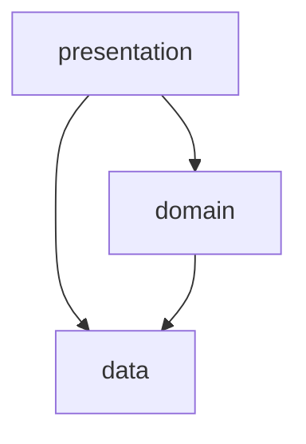
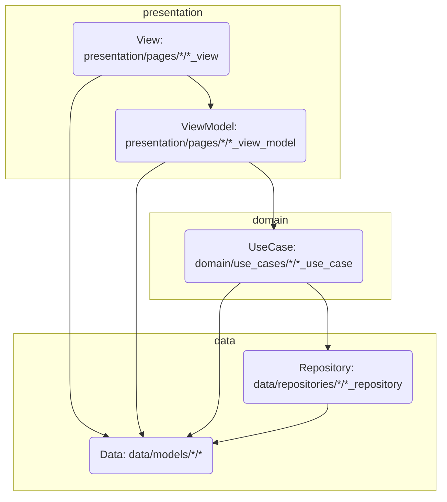

# Template Flutter Project                   
Flutter SDK = 3.27.2                         
# Set up for Development   

### Git clone app

If you have `Makefile` use this command below
```sh
make first_run
```
otherwise
```sh
fvm use 3.27.2 
cp ./assets/env/.env.example ./assets/env/.env
cp ./assets/env/.env.example ./assets/env/.env.dev
fvm flutter pub get     
fvm flutter packages pub run build_runner build --delete-conflicting-outputs
fvm flutter gen-l10n
```
### Firebase Config
```
https://codewithandrea.com/articles/flutter-firebase-multiple-flavors-flutterfire-cli/
chmod +x ./flutterfire-config.sh
```

1. Make sure your computer and editor are ready for Flutter development          
- https://docs.flutter.dev/get-started/editor              
                      
IDE:   
- Android Studio Chipmunk | 2021.2.1 or above (Flutter plugin `>= 67.1.2`) 
- Visual Studio Code v1.67.2 or above (Flutter plugin `>= v3.40.0`)        
              
2. Import this project (from the root ``) into your editor (ex: Android Studio, VS Code) 

```    
fvm flutter pub get     
fvm flutter packages pub run build_runner build --delete-conflicting-outputs
fvm flutter gen-l10n
```   

4. Run (use `` for phase 1). Choose in one of the ways below:
- Choose and run configuration from editor
- Run the following command on its root ``:
  
```
fvm flutter run lib/main_dev.dart --flavor=dev
fvm flutter run lib/main_prod.dart --flavor=prod
```

5. Code formatting (https://docs.flutter.dev/development/tools/formatting)
- Automatically formatting code
- Using trailing commas
## FVM
There are a few ways to install FVM, and we are working on other ways to make it even simpler.
* https://fvm.app/documentation/getting-started/installation

# Architecture & Development

Based on Layered Architecture.

## Architecture diagram

### overview



### detail
 



## Dependency Injection
- Use [GetIt](https://pub.dev/packages/get_it) + [Injectable](https://pub.dev/packages/injectable) for repository and use case
- Use [Bloc](https://pub.dev/packages/bloc) for state management

## Network
- Use [Dio](https://pub.dev/packages/dio) for HTTP client
- Use [Retrofit](https://pub.dev/packages/retrofit) for data parsing and auto serialization

## How to use models and entities
- data/models: declare network (API) and local database (sqlite) models in here
- domain/entities: declare models to be used in `views` (if needed)

## Localization
- Use default [Flutter localizations](https://api.flutter.dev/flutter/flutter_localizations/flutter_localizations-library.html) for localization
- Use plugin `Flutter Intl` for code generation, it supports for both [Android Studio](https://plugins.jetbrains.com/plugin/13666-flutter-intl) and [VS Code](https://marketplace.visualstudio.com/items?itemName=localizely.flutter-intl).
- Update localized string on `assets/l10n` folder. When save file, the plugin will auto generate code.

# Git and Pull Requests rules

- Pull requests are sent to 'main' branch
- Please fill in completely the pull request template
- The assignee is the responsible of pull request merging and conflict solving
